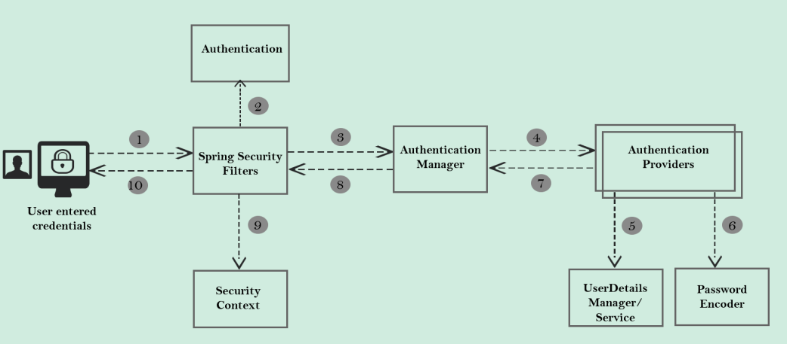

# Spring Security lépésről lépésre

Ennek a projektnek a keretén belül lépésről lépésre felépítünk egy Spring Security projektet.
A projekt egy banki alkalmazást fog szimulálni.
Az eredeti projekt, ami alapján haladni fogunk megtalálható
itt: https://www.udemy.com/course/spring-security-zero-to-master/
Az alkalmazásnak lesznek mindenki által elérhető részei (`/contact`, `/notices`), míg a többi végpontot levédjük

### -1.lépés - Spring Security működése



### 0. lépés - App security nélkül

1. indíts egy új Spring projectet
    - függőségek: spring boot web
   ```xml
        <dependency>
            <groupId>org.springframework.boot</groupId>
            <artifactId>spring-boot-starter-web</artifactId>
        </dependency>
   ```
2. Hozz létre egy kontrollert, aminek az egyik metódusa a `/welcome` végponton figyeli a get kéréseket, és egy Stringgel
   tér vissza.
3. Indítsd el a programot és nyisd meg a [localhost:8080/welcome]()  oldalt a böngésződben.
4. Láthatod, hogy a végpont tartalma jelenleg mindenki számára hozzáférhető.

### 1. lépés - Spring Security függőség hozzáadása

1. Add hozzá az alábbi függőséget:

```xml

<dependency>
    <groupId>org.springframework.boot</groupId>
    <artifactId>spring-boot-starter-security</artifactId>
</dependency>
```

2. Indítsd újra az alkalmazást, majd nézd meg a `/welcome` oldalt.
3. Láthatod, hogy `/login` oldalra jutottál, ahol be kell jelentkezned a folytatáshoz.
    - Akármennyi végpontod lenne, egyikhez se férsz hozzá, amíg be nem jelentkezel.
    - Az alkalmazás konolán megtalálod a generált jelszót a belépéshez.
    - A felhasználónév `user`
    - bejelntkezés után látható a kért végpont tartalma.
    - Újraindításnál új jelszó generálódik.
    - Minden látogatónak ugyanaz a jelszava és a felhasználóneve is.

4. Tedd statikussá a bejelntkezési adatokat az `application.properties`
   fájlban. (https://docs.spring.io/spring-boot/docs/current/reference/html/application-properties.html)

```properties
spring.security.user.name=username
spring.security.user.password=password
```

5. Nyisd meg a végpontot inkognitó módban (vagy töröld a sütik közül a `JSESSIONID`-t) és teszteld az újonnan beállított
   felhasználónevet és jelszót!
6. Készítsd el a az alábbi kontrollereket, és mindegyiknek legyen egy metódusa, ami egy Stringgel tér vissza és leírja,
   hogy épp hol vagyunk:
    - `AccountController`
      péda:
   ```java
   @GetMapping("/myAccount")
   public String getAccountDetail(){
   return "Here are the cards details from DB";
   }
   ```
    - `CardsController`
    - `LoanController`
    - `BalanceController`
    - `ContactController`
    - `NoticeController`

### 2. lépés - SecurityFilterChain beállítása

1. Alapértelmezetten minden végpont automatikusan zárva lesz, ezért explicit meg kell fogalmazni, ha valamely végponthoz
   nem szeretnénk bejelentkezéshez kötni az elérést
   ```java
    @Bean
    SecurityFilterChain defaultSecurityFilterChain(HttpSecurity http) throws Exception {
        http.authorizeHttpRequests((requests) -> requests.requestMatchers("/myAccount", "/myBalance", "/myLoans", "/myCards").authenticated()
                        .requestMatchers("/notices", "/contact").permitAll())
                .formLogin(Customizer.withDefaults())
                .httpBasic(Customizer.withDefaults());
        return http.build();
    }
   ```
    - A szűrőkről bővebben innen tájékozódj: https://docs.spring.io/spring-security/reference/servlet/architecture.html

### 3. lépés - Felhasználók definiálása és kezelése

Ahhoz, hogy megszüntethessük az `application.properties` fájlban rögzített belépési adatokat meg kell valósítanunk egy
másik bejelentkezési módot. Konkrétabban egy `UserDetailsManager` interfészt kell implementálni.

- Létezik egy `LdapUserDetailsManager` használata merülhet fel, de erre most nem térünk, mivel használata nem gyakori.
    - Az `InMemoryUserDetailsManager` alkalmazásával különböző felhasználókat álíthatunk be, különböző jogosultságokkal,
      de
      mindegyik paraméter beégetett, a belépési adatok kiolvashatók a kódból, stb ezért **ezt a módot ne használjuk**
      éles
      környezetben:

        ```java
           @Bean
      public InMemoryUserDetailsManager userDetailsService(){
              UserDetails admin=User.withDefaultPasswordEncoder()
              .username("admin")
              .password("12345")
              .authorities("admin")
              .build();
              UserDetails user=User.withDefaultPasswordEncoder()
              .username("user")
              .password("12345")
              .authorities("read")
              .build();
              return new InMemoryUserDetailsManager(admin,user);
              }
          ```

- A `JdbcUserManager` már adatbázisból kezeli a felhasználókat, de mi tovább megyünk és JPA entitásokat hozunk létre a
  felhasználók kezelésére pedig egy saját `UserDetailsService` megvalósítást fogunk kidolgozni.(ha
  kipróbáltad az `InMemoryUserDetailsManager`-t, akkor azt most töröld!):

1. Csatlakoztass egy adatbázist a projekthez (Ennek lépéseire nem térek ki, a továbbiakban MySQL adatbázist használunk).

- **Ne felejtsd el megadni a szükséges beállításokat az `application.properties` fájlban!**

2. A `SecurityConfig` osztályon belül hozd létre azt a Beant, ami gondoskodni fog a jelszavak tárolásáról. Ez most
   egyelőre egy olyan megvalósítás lesz, ami sima szövegként tárolja majd a jelszavakat, de később ezt le fogjuk
   cserélni.

   ```java
    @Bean
    public PasswordEncoder passwordEncoder() {
        return NoOpPasswordEncoder.getInstance();
    }
      ```

3. Hozd létre a `Customer` entitást, legyen meg minden getter/setter:
    - id: Long
    - email: String
    - pwd: String
    - role: String

4. Hozd létre a `CustomerRepository` osztályt, ami a `JpaRepository` osztály megvalósítása.

5. Hozd létre a `BankUserDetails` osztályt (`@Service`), ami implementálja a `UserDetailsService` interfészt
    - Injektáld a `CustomerRepository`-t
    - A felülírandó metódus megvalósításában határozhatod meg, hogy mi alapján jöjjön létre egy új `User`.
    - Ez a `User` a Spring Security egyik osztálya, amit az autentikáció és az autorizáció során is használhatunk majd.
   ```java
       @Override
    public UserDetails loadUserByUsername(String username) throws UsernameNotFoundException {
        Customer customer = customerRepository.findByEmail(username).orElse(null);
        if (customer == null) {
            throw new UsernameNotFoundException("User details not found for the user : " + username);
        } else {
            String userName = customer.getEmail();
            String password = customer.getPwd();
            List<GrantedAuthority> authorities = new ArrayList<>();
            authorities.add(new SimpleGrantedAuthority(customer.getRole()));
            return new User(userName, password, authorities);
        }
    }
    ```

### 4. Jelszavak biztonságos tárolása

A jelszavakat nem tárolhatjuk egyszerű szövegként, helyette kódolt, titkosított, vagy hash-elt módon kell kezelni

- kódolt: könnyen visszafejthető
- titkosított: kulccsal fejthető csak vissza
- hashelt: A hashelő algoritmus birtokában összehasonlíthatunk két hash-elt jelszót, hogy egyezőek-e
  Mi a hash-elt jelsókezelést választjuk, mert az így kezelt jelszó nem fejthető vissza

1. A `SecurityConfig` osztályban töröld a korábbi pw encodert és helyette készíts beant, ami egy `BCryptPasswordEncoder`
   -rel tér vissza:
    ```java
       @Bean
    public PasswordEncoder passwordEncoder() {
        return new BCryptPasswordEncoder();
    }

   ```
2. Add hozzá a szűrőkhöz a `/register` végpontot, hogy autentikáció nélkül is elérhető legyen és állítsd a
   csrf-t `disable()`-re
    - Ha ezekkel végeztlél, akkor a szűrő így néz ki:
    ```java
    @Bean
    SecurityFilterChain defaultSecurityFilterChain(HttpSecurity http) throws Exception {
        http.csrf((csrf) -> csrf.disable())
                .authorizeHttpRequests((requests) -> requests
                        .requestMatchers("/myAccount", "/myBalance", "/myLoans", "/myCards").authenticated()
                        .requestMatchers("/notices", "/contact", "/register").permitAll())
                .formLogin(Customizer.withDefaults())
                .httpBasic(Customizer.withDefaults());
        return http.build();
    }

   ```
3. Hozd létre a `LoginController`-t
    - Injektáld a következőket: `CustomerRepository`, `PasswordEncoder`
    - Készíts egy metódust (`@PostMapping("/register")`) a regisztrációhoz:
    - Itt a lényeg, hogy a beérkező jelszót ne csak sima szövegként állítsuk be az entitáshoz, hanem az encoderen
      keresztül hash-elve: `passwordEncoder.encode(customer.getPwd()`
    - A metódusunk valahogy így fog kinézni:
   ```java
    @PostMapping("/register")
    public ResponseEntity<String> registerUser(@RequestBody Customer customer) {
        Customer savedCustomer = null;
        ResponseEntity response = null;
        try {
            String hashPwd = passwordEncoder.encode(customer.getPwd());
            customer.setPwd(hashPwd);
            savedCustomer = customerRepository.save(customer);
            if (savedCustomer.getId() > 0) {
                response = ResponseEntity
                        .status(HttpStatus.CREATED)
                        .body("Given user details are successfully registered");
            }
        } catch (Exception ex) {
            response = ResponseEntity
                    .status(HttpStatus.INTERNAL_SERVER_ERROR)
                    .body("An exception occured due to " + ex.getMessage());
        }
        return response;
    }
    ```
4. Regisztrálj egy felhasználót Postman-en keresztül.
5. Ha mindent jól csináltunk, akkor az adatbázisban a jelszó oszlopában a hash-elt jelszót látod már.
    - Bejelentkezéskor a `BankUserDetails` gondoskodik a jelszavak összehasonlításáról
        - Mivel implementálja a `UserDetailsService` osztályt, ezért hozzáférése lesz a Spring alapértelmezett
          autentikációt biztosító osztályához, a `DaoAuthenticationProvider`-hez
        - A providernek van egy metódusa, ami a bean-né tett encoder alapján össze tudja hasonlítani a jelszavakat.

### 5. lépés - Egyedi AuthenticationProvider implementáció

Azért lehet szükséges az egyéni implementáció, mert előfordulhat olyan helyzet, hogy a belépést egyéni logikához
szeretnénk kötni, pl.:

- Többféle bejelentkezési módot is meg szeretnénk valósítani (pl. oauth2)
- Nem engedélyezett a belépés, csak bizonyos országokból.

Az egyedi megvalósításhoz az alábbiakat kell tenni:

1. Hozz létre egy új osztályt, ami implementálja az `AuthenticationProvider` interfészt

- annotáld komponensként (`@Component`)
- Injektáld a `CustomerRepository`-t és a `PasswordEncoder`-t

2. Valósítsd meg mindkét szükséges metódust:
    - A `supports(Class<?> authentication)` metódust megkeresheted a `DaoAuthenticationProvider` osztályban, és egy az
      egye idemásolhatod.

   ```java
   @Override
   public boolean supports(Class<?> authentication) {
   return (UsernamePasswordAuthenticationToken.class.isAssignableFrom(authentication));
   }
      ```
    - Az `authenticate(Authentication authentication)` metóduson belül tudod megírni a bejelentkeztetési logikát. Mi
      most az egyszerűség kedvéért nem kötünk ki további feltételeket, de figyeld meg, hogy a jelszavak
      összehasonlítását is explicit módon ki kell dolgozni!

   ```java
   @Override
    public Authentication authenticate(Authentication authentication) throws AuthenticationException {
        String username = authentication.getName();
        String pwd = authentication.getCredentials().toString();
        Customer customer = customerRepository.findByEmail(username).orElse(null);
        if (customer != null) {
            if (passwordEncoder.matches(pwd, customer.getPwd())) {
                List<GrantedAuthority> authorities = new ArrayList<>();
                authorities.add(new SimpleGrantedAuthority(customer.getRole()));
                return new UsernamePasswordAuthenticationToken(username, pwd, authorities);
            } else {
                throw new BadCredentialsException("Invalid password!");
            }
        }else {
            throw new BadCredentialsException("No user registered with this details!");
        }
    }
      ```
    - További különbség, hogy Itt már nem egy `User`-rel, hanem egy `UsernamePasswordAuthenticationToken`-nel térünk
      vissza sikeres autentikáció esetén.
        - a `UsernamePasswordAuthenticationToken` lehetőséget biztosít arra, hogy a hitelesítési adatokat átadják az
          autentikációs folyamathoz, míg a `User` osztály teljes felhasználói adatokat reprezentál, és általában az
          alkalmazás belső részéhez kapcsolódik.
3. Jelenleg két osztályunk gondoskodik a bejelentkeztetésről és a Spring dönt, hogy melyik lép érvénybe. Mi az egyéni
   megvalósításunkkal fogunk továbbhaladni, így a beépített megoldásra nincs szükségünk: töröld azt az osztályt!

### 6. lépés - CORS és CRSF

Ahhoz hogy tovább tudjunk lépni, fel kell építeni az alaklmazás frontend részét. Ennek menetére nem térünk ki
részletesen.

- **Az új kódokat a "create new codebase for step#6" commit tartalmazza**
- Mivel ez nem egy MVC vagy Angular bemutató, ezért az ezekkel kapcsolatos lépésekre nem térünk ki.

0. Dobd el az eddigi táblákat, futtasd a projektet, majd a project `resources` mappájában található `script.sql`
   futtatásával töltsd fel az adatbázist néhány adattal. Szánj rá kb fél órát, hogy megismerd az újonnan létrehozott
   osztályokat és az Angular projectet!
1. Hozz létre Postman-nel egy új felhasználót!
2. Indítsd el a frontendet (előtte `npm i`, ha még nem tetted!) és próbálj bejelntkezni a `localhost:4200/login`
   oldalon.
    - Nyisd meg a böngészőben a konzolt és nézd meg milyen hibát kaptál.
    - A böngésző alapbeállítása, hogy megvédje az adatot/kommunikációt és ne engedje annak megosztását két különböző
      domain között. (CORS)
    - Figyelembe vett különbségek:
        - különböző séma: HTTP vagy HTTPS
        - különböző port: localhost:8080 vagy localhost:4200
        - különböző domain: https://domain1.com vagy https://domain2.com
        - A beállítás elvégezhető annotáció használatával is `@CrossOrigin(origins = "http://localhost:4200")`, de sok
          ismétlődést, és nehezen kezelhetőséget eredményezne, ezért mi nem így fogjuk elvégezni a beállítást
3. A CORS globális beállításához nyisd meg a `SecurityConfig` osztályt, és módosítsd a szűrőláncot erre:
   ```java

    @Bean
    SecurityFilterChain defaultSecurityFilterChain(HttpSecurity http) throws Exception {
        http
                .cors(corsCustomizer -> corsCustomizer.configurationSource(new CorsConfigurationSource() {
                    @Override
                    public CorsConfiguration getCorsConfiguration(HttpServletRequest request) {
                        CorsConfiguration config = new CorsConfiguration();
                        config.setAllowedOrigins(Collections.singletonList("http://localhost:4200"));
                        config.setAllowedMethods(Collections.singletonList("*"));
                        config.setAllowCredentials(true);
                        config.setAllowedHeaders(Collections.singletonList("*"));
                        config.setMaxAge(3600L);
                        return config;
                    }
                })).csrf((csrf) -> csrf.disable())
                .authorizeHttpRequests((requests)->requests
                        .requestMatchers("/myAccount", "/myBalance", "/myLoans", "/myCards", "/user").authenticated()
                        .requestMatchers("/notices", "/contact", "/register").permitAll())
                .formLogin(Customizer.withDefaults())
                .httpBasic(Customizer.withDefaults());
        return http.build();
    }
   ```

   Látható, hogy a korábbi metódust a cors beállításokkal bővítettük:
    - `setAllowedOrigins`: itt határozhatod meg, hogy mik azok az eredetitől eltérő címek, amik engedélyezettek
    - `setAllowedMethods`: engedélyezett metódusok "*" = minden
    - `setAllowCredentials`: Ha true, akkor a böngésző engedélyezi a JavaScriptnek, hogy hozzáférjen a kéréshez küldött
      adatokhoz, például sütikhez vagy HTTP hitelesítési információkhoz, amikor azokat egy másik eredeti (domain) címről
      történő kéréstől kapja.
    - `setAllowedHeaders`: Beállíthtó hogy a JS milyen HTTP fejlécet küldhet. Egyelőre mindent engedélyezünk
    - `config.setMaxAge`: A böngésző érzékeli, hogy másik eredetiről érkezik kérés, de alapértelmezetten minden
      alkalommal elküld egy preflight kérést, viszont ha beállítunk egy mp alapú időkeretet, akkor a megadott időn belül
      biztosított a hozzáférés kérelem nélkül is az azonos erőforrások esetén

Korábban megfigyelhetted, hogy a csrf ki van kapcsolva. Erre azért volt szükség, mert a Spring Security
alapértelmezetten neme engedélyezi a POST/PUT/DELETE/PATCH műveleteket, így nem tudtunk volna pl. új felhasználót
létrehozni.
A csrf támadás során a hacker megpróbál rávenni, hogy kattints egy linkre, ami a háttérben pl. egy post kérést indít pl.
a facebook felé, hogy megváltoztassa a felhasználó email címét.
Ha a facebook nem védekezik a csrf támadás ellen, és ha ez a kérés ugyanabból a böngészőből indul, és a felhasználó be
van jelentkezve, akkor a hacker ki tudja cserélni az email címet.
Éppen ezért:

**Éles környezetben soha ne kapcsold ki a csrf védelmet!**

4. Hozz létre egy osztályt, ami a `OncePerRequestFilter' absztrakt osztály leszármazottja.
    - írd fölül a `doFilterInternal` metódust
        - hozz létre egy új `CsrfToken`-t a requestből kinyerhető csrf token alapján
        - ha a token header neve nem null, akkor állítsd be a válasz headert a token alapján

   ```java
   public class CsrfCookieFilter extends OncePerRequestFilter {

    @Override
    protected void doFilterInternal(HttpServletRequest request, HttpServletResponse response, FilterChain filterChain)
            throws ServletException, IOException {
        CsrfToken csrfToken = (CsrfToken) request.getAttribute(CsrfToken.class.getName());
        if(null != csrfToken.getHeaderName()){
            response.setHeader(csrfToken.getHeaderName(), csrfToken.getToken());
        }
        filterChain.doFilter(request, response);
       }
   }
   ```   
   Ezt az osztályt be fogjuk kötni a szűrőbe, hogy az alaklmazás képes legyen minden kéréshez tokent küldeni

5. A CSRF beállításhoz módosítsd a szűrőt az alábbi szerint:

   ```java
    @Bean
    SecurityFilterChain defaultSecurityFilterChain(HttpSecurity http) throws Exception {
        CsrfTokenRequestAttributeHandler requestHandler = new CsrfTokenRequestAttributeHandler();
        requestHandler.setCsrfRequestAttributeName("_csrf");

        http.securityContext((context) -> context
                        .requireExplicitSave(false))
                .sessionManagement(session -> session.sessionCreationPolicy(SessionCreationPolicy.ALWAYS))
                .cors(corsCustomizer -> corsCustomizer.configurationSource(new CorsConfigurationSource() {
                    @Override
                    public CorsConfiguration getCorsConfiguration(HttpServletRequest request) {
                        CorsConfiguration config = new CorsConfiguration();
                        config.setAllowedOrigins(Collections.singletonList("http://localhost:4200"));
                        config.setAllowedMethods(Collections.singletonList("*"));
                        config.setAllowCredentials(true);
                        config.setAllowedHeaders(Collections.singletonList("*"));
                        config.setMaxAge(3600L);
                        return config;
                    }
                })).csrf((csrf) -> csrf.csrfTokenRequestHandler(requestHandler).ignoringRequestMatchers("/contact", "/register")
                        .csrfTokenRepository(CookieCsrfTokenRepository.withHttpOnlyFalse()))
                .addFilterAfter(new CsrfCookieFilter(), BasicAuthenticationFilter.class)
                .authorizeHttpRequests((requests)->requests
                        .requestMatchers("/myAccount", "/myBalance", "/myLoans", "/myCards", "/user").authenticated()
                        .requestMatchers("/notices", "/contact", "/register").permitAll())
                .formLogin(Customizer.withDefaults())
                .httpBasic(Customizer.withDefaults());
        return http.build();
    }
   ```

Ha helyesen konfiguráltuk a csrf beállításokat, akkor az oldalunk egy random módon generált CSRF Tokent ad hozzá rejtett
paraméterként a felhasználó session-jéhez.
Ha a felhasználó rákattint a támadó linkjére, akkor a kérést a szerverünk 403-as hibakóddal el fogja utasítani, mivel a
kérés nem rendelkeznek a megfelelő CSRF tokennel.

Nézzük meg mi is történt a fenti kódban:

- `CsrfTokenRequestAttributeHandler` : A CsrfTokenRequestHandler interfész implemetációja, amely képes a CsrfTokent
  kérés attribútumként elérhetővé tenni, és a token értékét a kérés fejléceként vagy paraméterértékeként feloldani.
- A metódusláncon belül:
    - `securityContext`: ez a konfiguráció azt mondja meg a Spring Security-nek, hogy az azonosításokat automatikusan
      mentse és mindig hozzon létre munkameneteket a felhasználók számára, amikor szükség van rájuk. Ennek a két sornak
      köszönhetően nem kell minden alkalommal megosztani a credentials-t az Angular alkalmazással
    - meghatározzuk a tokenkezelő objektumot
    - beállítjuk, hogy mely végpontokat hagyja figyelmen kívül
    - `.csrfTokenRepository(CookieCsrfTokenRepository.withHttpOnlyFalse())`: a csrf tokent a böngésző küldi a szervernek
      minden kérés mellé, de alapértelmezetten a JS ezt nem teheti meg, ezért explicit módon fel kell oldani az erre
      vonatkozó szabályt
    - `addFilterAfter`: közbeiktatja az egyedi szűrőnket, miután a basic autentikáció megtörtént.

6. Frontenden is gondoskodni kell a csrf token kezeléséről:
    - A `login.component.ts` fájlon belül egészítsd ki két sorral a `validateUser` funkciót, és importáld a szükséges
      függőséget:

   ```typescript
        let xsrf = getCookie('XSRF-TOKEN')!;
        window.sessionStorage.setItem("XSRF-TOKEN", xsrf);
   ```
    - Spring Security "XSRF-TOKEN" névvel fogja küldeni a sütit, míg a böngészőtől "X-XSRF-TOKEN" néven várja. Következő
      lépésként ezért az interceptorban be kell állítani a headert ennek megfelelően. Ehhez egészítsd ki
      az `app.request.interceptor.ts` fájlt:
   ```typescript
        let xsrf = sessionStorage.getItem('XSRF-TOKEN');
    if (xsrf){
      httpHeaders = httpHeaders.append('X-XSRF-TOKEN', xsrf);
    }
   ```
    - Eztkövetően már minden egyes kérésnél visszaküldi a tokent a böngésző (kivéve: nem bejelntkezett felhasználó és le
      nem védett végpontok esetén)
    - Ellenőrizd a sütiket a böngésző konzolán! Bejelntkezés után már nem csak a JSESSIONID, de az XSRF-TOKEN is ott
      kell legyen

### 7. lépés - Autorizáció

A sikeres autentikációt az autorizáció követi: Miután azonosítottuk magunkat, igazolnunk kell, hogy meg van a szükséges
felhatalmazásunk az oldal használni kívánt funkciójához
A projekt jelenlegi állapotában regisztráció során minden felhasználónak beállítjuk a `role` fieldjét
automatikusan `"user"`-re, de fejlesztéseink révén szeretnénk majd elérni, hogy több szerepkört is ki lehessen osztani.

1. Hozz létre egy új entitást: Authority
    - id: Long
    - name: String
    - customer: Customer (@ManyToOne @JoinColumn(name="customer_id"))

2. Add hozzá a Customer fieldjeihez az alábbit és készíts hozzá gettert/settert
   ```java
    @JsonIgnore
    @OneToMany(mappedBy = "customer", fetch = FetchType.EAGER)
    private Set<Authority> authorities;
   ```
3. Hozz létre egy segédmetódust a `BankUsernamePasswordProvider` osztályban! Ez a metódus létrehoz
   egy `GrantedAuthorities` listát a bemeneti string lista alapján. Ez a metódus tulajdonképpen a 38-39.sor
   kiszervezése:
   ```java
    private List<GrantedAuthority> getGrantedAuthorities(Set<Authority> authorities) {
        List<GrantedAuthority> grantedAuthorities = new ArrayList<>();
        for (Authority authority : authorities) {
            grantedAuthorities.add(new SimpleGrantedAuthority(authority.getName()));
        }
        return grantedAuthorities;
    }
   ```
4. Az `authenticate` metódusban a visszatérési érték `authorities` paraméterét cseréld ki a metódussal, majd töröld ki a
   sorokat, amiket kivált.

   ```java
    @Override
    public Authentication authenticate(Authentication authentication) throws AuthenticationException {
        String username = authentication.getName();
        String pwd = authentication.getCredentials().toString();
        Customer customer = customerRepository.findByEmail(username).orElse(null);
        if (customer != null) {
            if (passwordEncoder.matches(pwd, customer.getPwd())) {
                return new UsernamePasswordAuthenticationToken(username, pwd, getGrantedAuthorities(customer.getAuthorities()));
            } else {
                throw new BadCredentialsException("Invalid password!");
            }
        }else {
            throw new BadCredentialsException("No user registered with this details!");
        }
    }
   ```
5. Töltsd fel adattal az autorities táblát
   ```sql
   INSERT INTO `authorities` (`customer_id`, `name`)
   VALUES (1, 'VIEWACCOUNT');
   
   INSERT INTO `authorities` (`customer_id`, `name`)
   VALUES (1, 'VIEWCARDS');
   
   INSERT INTO `authorities` (`customer_id`, `name`)
   VALUES (1, 'VIEWLOANS');
   
   INSERT INTO `authorities` (`customer_id`, `name`)
   VALUES (1, 'VIEWBALANCE');
   ```

6. Tegyél egy breakpointot az `authenticate` metódus második sorára, majd futtasd a programut debug módban és jelentkezz
   be! A customer fieldjei között meg kell jelenjen az authorities lista
   

7. Ezt követően átállíthatjuk a szűrőnket, hogy bizonyos végpontok csak akkor legyenek hozzáférhetők, ha a felhasználó
   rendelkezik bizonyos jogosultságokkal.
   Ha szeretnéd tesztelni, akkor megteheted, hogy kitörölsz egy jogosultságot az adatbázisból, és felkeresed az ahhoz
   tartozó végpontot. Az eredmény 403-as hbakód lesz
   ```java
                .authorizeHttpRequests((requests) -> requests
                        .requestMatchers("/myAccount").hasAuthority("VIEWACCOUNT")
                        .requestMatchers("/myBalance").hasAnyAuthority("VIEWACCOUNT", "VIEWBALANCE")
                        .requestMatchers("/myLoans").hasAuthority("VIEWLOANS")
                        .requestMatchers("/myCards").hasAuthority("VIEWCARDS")
                        .requestMatchers("/user").authenticated()
                        .requestMatchers("/notices", "/contact", "/register").permitAll())
   ```

Már egy közepes méretű alkalmazásnál is átláthatatlanná válhat a fenti megközelítés. Ennek áthidalása végett
használhatsz a jogosultságok helyett szerepköröket (authority vs. role)
A role-okkal csoportosíthatod a jogosultságokat. Alakítsuk át a jelenlegi autorizációt és használjunk helyette
szerepköröket! Ezt gyorsan meg tudjuk valósítani, mivel ugyanazt az interfészt kell implementálni. Egy dologra kell
fokozottan odafigyelni, hogy a Spring Security számára jelezni kell a különbséget role és autorizáció között.
Ha valamit role-ként definiálsz, akkor azt minden esetben **"ROLE_"** előtaggal kell ellátnod. Pl.: `ROLE_USER`

1. Töröld ki a jelenlegi jogosultságokat az `authorities` táblából, és helyettük vegyél fel role-okat
   ```sql
   DELETE FROM `authorities`;
   
   INSERT INTO `authorities` (`customer_id`, `name`)
   VALUES (1, 'ROLE_USER');
   
   INSERT INTO `authorities` (`customer_id`, `name`)
   VALUES (1, 'ROLE_ADMIN');
   ```

2. A szűrőben cseréld ki a `hasAuthority`, `hasAnyAuthority` metódusokat `hasRole` és `hasAnyRole` metódusokra, és
   paraméterként használd a szerepköröket. Figyelj rá, hogy a metódus string formában kéri a paramétert, és "ROLE_"
   előtagot nem kell megadnod!

   ```java
                .authorizeHttpRequests((requests) -> requests
                        .requestMatchers("/myAccount").hasRole("USER")
                        .requestMatchers("/myBalance").hasAnyRole("USER","ADMIN")
                        .requestMatchers("/myLoans").hasRole("USER")
                        .requestMatchers("/myCards").hasRole("USER")
                        .requestMatchers("/user").authenticated()
                        .requestMatchers("/notices","/contact","/register").permitAll())

   ```

### 8. lépés - Saját szűrő használata

A korábbi lépések során már létrehoztunk egy egyéni szűrőt, hogy képesek legyünk csrf tokenek átadásra/fogadására. Ebben
a lépésben kicsit részletesebben is bemutatjuk a kapcsolódó tudnivalókat.
A filter tulajdonképpen az első réteg, amivel szembetalálkozik egy beérkező kérés. Habár ismerünk már néhány beépített
szűrőt (pl.: BasicAuthenticationFilter),
nem árt tudni, hogy a szűrők láncolatához saját szűrőt is hozzáadhatunk. Néhány példa, hogy miért lehet szükség erre:

- Ip címek loggolása
- adatok kódolás bejelentkezés előtt
- többlépcsős azonosítás (OTP... nem a bank: One-Time Password)

És még sorolhatnánk. Minden ezekhez hasonló esetben módosítani kell a szűrőláncot, és gyakran saját szűrőt kell
közbeiktatni.
Javaslom, hogy keresd meg a `FilterChainProxy` osztályt, és tanulmányozd a benne megírt metódusokat!
Mélyrehatóan tudod tanulmányozni a működésüket, ha elvégzed az alábbi beállításokat, majd debugger módban indítod el az
aplikációt:

- az appot annotálod a következővel: `@EnableWebSecurity(debug=true)`
- application.properties-ben: `logging.level.org.springframework.security.web.FilterChainProxy=DEBUG`

**!!! Ezt a beállítást kizárólag fejlesztés közben használd! Éles környezetben ezekkel a beálításokkal érzékeny adatok
kerülhetnek nyivánosságra.**
És a továbbhaladáshoz sincs szükség rá, úgyhogy töröld a fenti beállításokat, ha már végeztél a tanulmányozással!

1. Implementálnunk kell a `Filter` interfészt (jakarta.servlet).
   A létrehozott osztályunkban így meg kell valósítani a `doFilter` metódust, ami három paramétert fogad:
    - HttpServletRequest: kérés kezelésére
    - HttpServletResponse: válasz kezelésére
    - FilterChain: szűrőláncba építéshez

2. Miután megírtuk a szűrő logikáját, beilleszthetjük a szűrőláncba. Ezt három lehetőség közül válasthatjuk meg hogyan
   kivitelezzük:
    - .addfilterBefore(new EgyéniSzűrőOsztályNeve(), SzűrőOsztályAmiElőttHasználjuk) - pl validálás
    - .addfilterAfter(new EgyéniSzűrőOsztályNeve(), SzűrőOsztályAmiutánHasználjuk) - pl loggolás
    - .addfilterAt(new EgyéniSzűrőOsztályNeve(), SzűrőOsztályAmivelEgyüttHasználjuk) - sorrend nem befolyásolható!

Próbáljunk ki egyet a gyakorlatban!

```java
   import jakarta.servlet.*;
import org.springframework.security.core.Authentication;
import org.springframework.security.core.context.SecurityContextHolder;

import java.io.IOException;
import java.util.logging.Logger;

public class AuthoritiesLoggingAfterFilter implements Filter {

    private final Logger LOG =
            Logger.getLogger(AuthoritiesLoggingAfterFilter.class.getName());

    @Override
    public void doFilter(ServletRequest request, ServletResponse response, FilterChain chain)
            throws IOException, ServletException {

        Authentication authentication = SecurityContextHolder.getContext().getAuthentication();
        if (null != authentication) {
            LOG.info("User " + authentication.getName() + " is successfully authenticated and "
                    + "has the authorities " + authentication.getAuthorities().toString());
        }
        chain.doFilter(request, response);
    }

}
   ```

Miután ezt létrehoztad, illeszd be a szűrőláncba azáltal, hogy hozzáadod ezt a sort az `.authorizeHttpRequests` elé:

   ```java
       .addFilterAfter(new AuthoritiesLoggingAfterFilter(),BasicAuthenticationFilter.class)

```

Indítsd újra a programot, és jelentkezz be az oldalon, majd figyeld meg, hogy a kódszerkesztő konzolán megjelent a
kívánt log.

##### GenericFilterBean és OncePerRequestFilter

Úgy is megoldható az egyéni szűrő létrehozása, ha a fenti két interfész valamelyikét implementáljuk

##### GenericFilterBean:

- Az AbstractAuthenticationProcessingFilter ősosztálya.
- Általános célú szűrőként használható, amelyek nem feltétlenül kapcsolódnak az azonosítás és az engedélyezés folyamatához.
- Nem biztosítja az automatikus egyszerre futás ellenőrzést, tehát nem garantálja, hogy a szűrő csak egyszer fut le
  minden kérés esetén.
-Használatra példa: ha egy általános célú szűrőt kívánsz létrehozni, amely nem szorosan kapcsolódik az
azonosításhoz vagy engedélyezéshez, és nincs szükség rá, hogy minden kérés esetén csak egyszer fusson le.

##### OncePerRequestFilter:

- Garantálja, hogy a szűrőt minden HTTP kérés esetén csak egyszer hajtja végre, és nem ismétli meg a feldolgozást, ha a
kérés további szűrőket vagy kezelőkét érint.
- Gyakran használják olyan szűrőknél, amelyek közvetlenül kapcsolódnak az azonosítás és az engedélyezés folyamatához,
például az autentikációs vagy jogosultság-ellenőrző szűrőknél.
- Használatra példa: Ha egy szűrőt kívánsz készíteni, amely közvetlenül kapcsolódik az azonosításhoz vagy
engedélyezéshez, és biztosítani akarod, hogy a szűrőd csak egyszer fusson le minden kérés esetén, még akkor is, ha több
további szűrőt vagy kezelőt alkalmaznak a kérés során.


